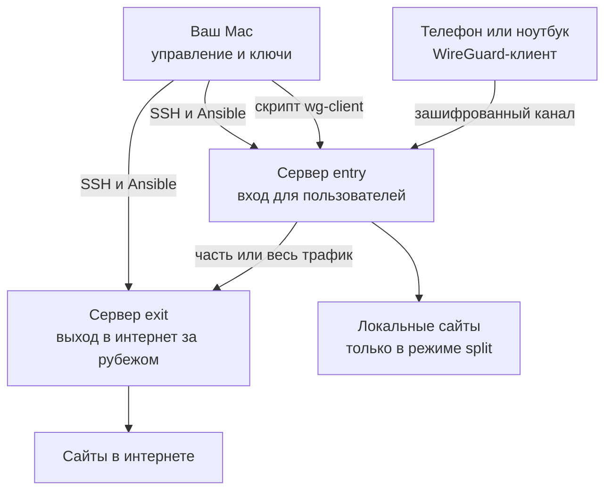
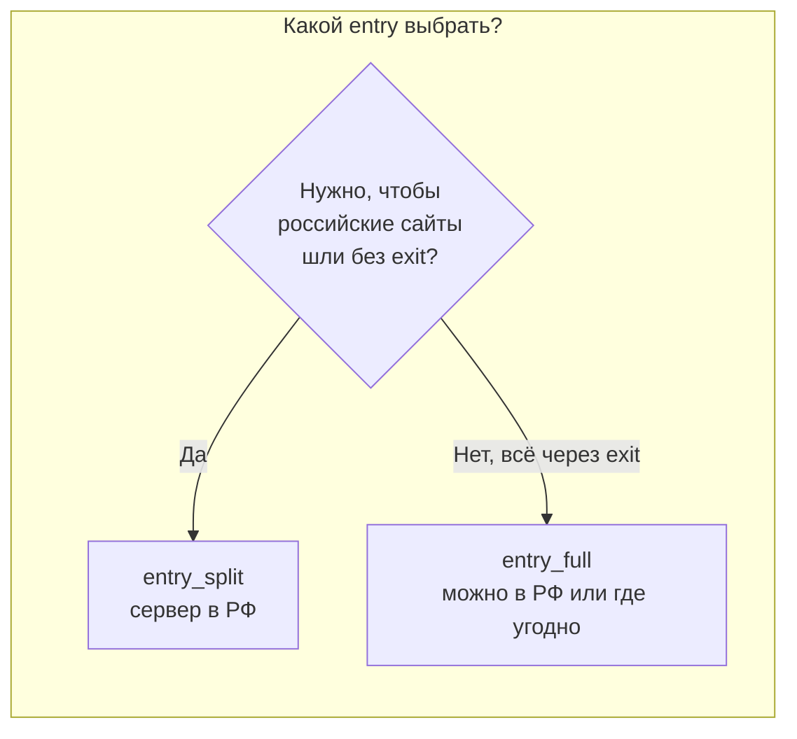
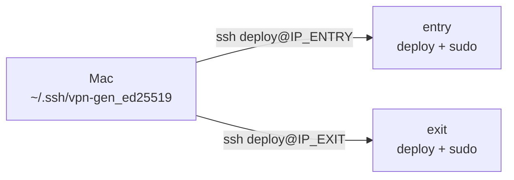
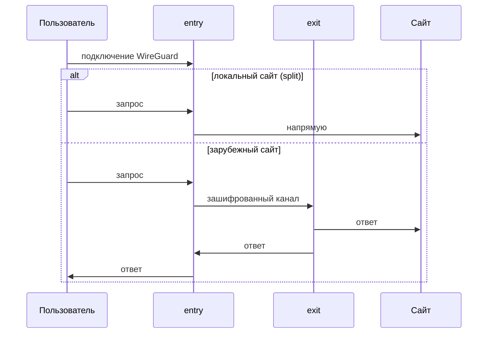
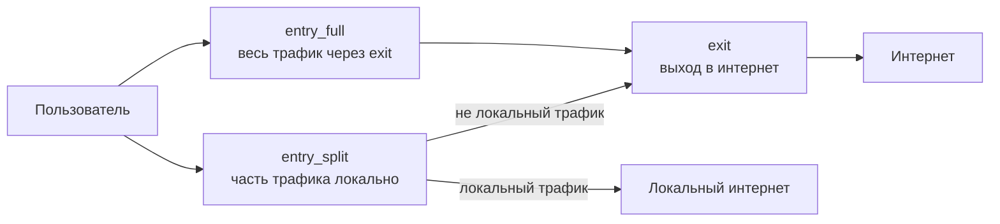
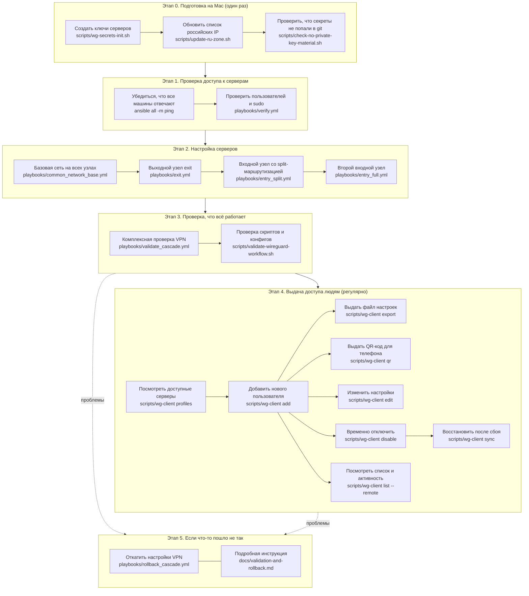

# Каскадный VPN (Ansible)

Переносимая автоматизация **каскадного VPN**: пользователь подключается к **entry**; трафик выходит локально (режим split) или через **exit** за рубежом.

Универсальные роли и плейбуки — здесь. Конкретные IP, SSH и провайдер — в [`deployments/`](deployments/). Живой пример: [`deployments/yandex-racknerd/`](deployments/yandex-racknerd/README.md).

**Оглавление документации:** [`docs/README.md`](docs/README.md)  
**План имён:** [`docs/naming-and-deployment-plan.md`](docs/naming-and-deployment-plan.md)

## Переменные окружения

IP-адреса, SSH-ключи и пути к секретам **не зашиты в репозиторий**. Задаются через файл `ansible/.env` (см. [`.env.example`](.env.example)).

```sh
cd ansible
cp .env.example .env
# отредактируйте .env под свои серверы и пути
source scripts/load-env.sh
```

Перед `ansible-playbook`, `wg-secrets-init.sh` и `wg-client` загружайте окружение (`source scripts/load-env.sh` или `set -a; source .env; set +a`).

| Переменная | Назначение |
|------------|------------|
| `VPN_GEN_ENTRY_SPLIT_HOST` | IP split entry |
| `VPN_GEN_ENTRY_FULL_HOST` | IP full entry |
| `VPN_GEN_EXIT_HOST` | IP exit |
| `VPN_GEN_SSH_KEY_ENTRY` | приватный SSH-ключ для entry (`~/.ssh/...`) |
| `VPN_GEN_SSH_KEY_EXIT` | приватный SSH-ключ для exit |
| `VPN_GEN_WG_SECRET_DIR` | каталог WG-ключей split/exit transit (по умолчанию `$HOME/.config/vpn-gen/wireguard`) |
| `VPN_GEN_WG_ENTRY_FULL_SECRET_DIR` | каталог ключей full entry |
| `VPN_GEN_RU_ZONE_FILE` | файл GeoIP для split (`ru.zone`) |
| `VPN_GEN_DEPLOYMENT` | имя деплоя для `wg-client` (например `reference` или `yandex-racknerd`) |
| `VPN_GEN_EXIT_ENTRY_FULL_ENABLED` | `true` только если exit обслуживает и split, и full entry (3 узла) |

Универсальный шаблон — [`.env.example`](.env.example) (везде `deploy`). Частный Yandex + Racknerd — [`deployments/yandex-racknerd/.env.example`](deployments/yandex-racknerd/.env.example).

Dry-run сценария для нового пользователя:

```sh
./scripts/dry-run-user-journey.sh                  # generic VPS (по умолчанию)
./scripts/dry-run-user-journey.sh --profile yandex-racknerd
```

## Быстрый старт, пошаговая инструкция

Инструкция для человека, который впервые разворачивает vpn-gen. Предполагается, что у вас есть **Mac** (управление) и **два виртуальных сервера** в интернете: один ближе к пользователям (вход), второй за рубежом (выход).

### Что получится в итоге



Пользователь подключается к **entry**. В режиме **split** запросы к «своим» сайтам идут напрямую из страны entry; остальные — через **exit**. В режиме **full** весь трафик идёт через exit.

### Шаг 0. Установите программы на Mac

```sh
brew install ansible wireguard-tools qrencode
git clone https://github.com/ca11mebaraka/vpn-gen.git
cd vpn-gen/ansible
```

Проверка:

```sh
ansible --version
wg --version
```

### Шаг 1. Выберите серверы

Нужны **Ubuntu 24.04**, белый IP-адрес и доступ по SSH с ключом (не по паролю).

#### Сервер entry (вход для пользователей)

| Вариант | Где | Кому подходит | Режим |
|---------|-----|---------------|-------|
| Yandex Cloud | Россия | Пользователи в РФ, нужен split (локальные сайты без VPN-выхода) | `entry_split` |
| VK Cloud, Selectel, Timeweb Cloud | Россия | То же | `entry_split` |
| Любой VPS в РФ или рядом | РФ / СНГ | Простой вход без разделения трафика | `entry_full` |

**Минимум для старта:** один сервер entry в режиме **split** — этого достаточно, если нужен «умный» VPN (локальное — напрямую, остальное — за рубежом).

#### Сервер exit (выход в интернет)

| Вариант | Где | Заметка |
|---------|-----|---------|
| Racknerd | США | Недорогой VPS, уже проверен в [reference-деплое](deployments/yandex-racknerd/README.md) |
| BuyVM, HostHatch | США / Европа | Бюджетные VPS |
| Hetzner | Финляндия, Германия, США | Стабильная сеть |
| OVH, DigitalOcean | EU / US | Универсальный выбор |

**Минимум для старта:** один VPS за рубежом с Ubuntu 24.04, 1 vCPU, 1 GB RAM — для exit обычно хватает.



| Схема | Серверов | Когда |
|-------|----------|-------|
| **Базовая** | 1 entry (split) + 1 exit | Рекомендуется для большинства |
| **Полный выход** | 1 entry (full) + 1 exit | Весь трафик только через exit |
| **Два входа** | split + full + 1 exit | Разные профили для разных людей (как в reference) |

### Шаг 2. Настройте SSH-доступ

Ansible с вашего Mac заходит на серверы по SSH **под обычным пользователем с правами администратора**. Ниже — что сделать **на Mac** и **на каждом сервере** (entry и exit отдельно).

#### 2.1. На Mac: ключ для входа на серверы

Если ключа ещё нет:

```sh
ssh-keygen -t ed25519 -f ~/.ssh/vpn-gen_ed25519 -C "vpn-gen"
chmod 600 ~/.ssh/vpn-gen_ed25519
chmod 644 ~/.ssh/vpn-gen_ed25519.pub
```

Показать публичную часть (её нужно будет положить на серверы):

```sh
cat ~/.ssh/vpn-gen_ed25519.pub
```

Пример вывода (ваш будет другой):

```text
ssh-ed25519 AAAA...xyz vpn-gen
```

Дальше в примерах:

| Переменная | Пример | Ваше значение |
|------------|--------|---------------|
| `IP_ENTRY` | `51.250.14.221` | IP сервера entry |
| `IP_EXIT` | `172.245.154.109` | IP сервера exit |
| `SSH_KEY` | `~/.ssh/vpn-gen_ed25519` | путь к **приватному** ключу на Mac |
| `DEPLOY_USER` | `deploy` | имя пользователя на сервере (можно другое, но одинаковое в inventory) |

#### 2.2. На сервере entry: первый вход и пользователь `deploy`

**Где:** виртуальная машина entry (Ubuntu 24.04).  
**Как зайти первый раз** — зависит от провайдера:

| Провайдер | Первый вход | Пример |
|-----------|-------------|--------|
| Yandex Cloud | пользователь `yc-user`, ключ задаётся при создании VM | `ssh -i ~/.ssh/yc_vm_ed25519 yc-user@51.250.14.221` |
| Другой VPS | часто `root` по паролю из письма или по ключу | `ssh root@51.250.14.221` |

**На сервере entry** (под `root` или под пользователем с `sudo`) выполните одним блоком — подставьте содержимое **вашего** `vpn-gen_ed25519.pub`:

```sh
DEPLOY_USER=deploy
PUBKEY='ssh-ed25519 AAAA...xyz vpn-gen'   # вставьте строку из cat ~/.ssh/vpn-gen_ed25519.pub

id -u "$DEPLOY_USER" >/dev/null 2>&1 || useradd -m -s /bin/bash "$DEPLOY_USER"
usermod -aG sudo "$DEPLOY_USER"
install -d -m 700 -o "$DEPLOY_USER" -g "$DEPLOY_USER" "/home/$DEPLOY_USER/.ssh"
echo "$PUBKEY" >> "/home/$DEPLOY_USER/.ssh/authorized_keys"
chmod 600 "/home/$DEPLOY_USER/.ssh/authorized_keys"
chown -R "$DEPLOY_USER:$DEPLOY_USER" "/home/$DEPLOY_USER/.ssh"
echo "$DEPLOY_USER ALL=(ALL) NOPASSWD:ALL" > "/etc/sudoers.d/$DEPLOY_USER"
chmod 440 "/etc/sudoers.d/$DEPLOY_USER"
```

**На Mac** проверьте вход **уже под `deploy`**, без пароля:

```sh
ssh -i ~/.ssh/vpn-gen_ed25519 deploy@51.250.14.221 'whoami && sudo -n true && echo OK'
```

Ожидается: `deploy`, затем `OK`. Если `Permission denied` — ключ или `authorized_keys` настроены неверно.

> Для Yandex Cloud часто остаются два пользователя: `yc-user` (создан облаком) и `deploy` (для Ansible). В inventory укажите того, под кем реально будете работать — в reference-деплое для entry split это `deploy`.

#### 2.3. На сервере exit: то же самое

**Где:** VPS exit за рубежом (Ubuntu 24.04).  
**Первый вход** — обычно от `root` (пароль из панели провайдера):

```sh
ssh root@172.245.154.109
```

На сервере exit — **те же команды**, что в п. 2.2 (создание `deploy`, ключ, sudo без пароля). Можно использовать **тот же** публичный ключ с Mac.

**На Mac** проверка:

```sh
ssh -i ~/.ssh/vpn-gen_ed25519 deploy@172.245.154.109 'whoami && sudo -n true && echo OK'
```

#### 2.4. Итоговая проверка с Mac

Оба сервера должны отвечать:

```sh
ssh -i ~/.ssh/vpn-gen_ed25519 deploy@51.250.14.221 'hostname; uptime'
ssh -i ~/.ssh/vpn-gen_ed25519 deploy@172.245.154.109 'hostname; uptime'
```

Сохраните для следующего шага — в **`ansible/.env`** (не в inventory):

```sh
cp .env.example .env
```

Пример фрагмента `.env`:

```sh
VPN_GEN_ENTRY_SPLIT_HOST=203.0.113.10
VPN_GEN_EXIT_HOST=198.51.100.20
VPN_GEN_ENTRY_SPLIT_SSH_USER=deploy
VPN_GEN_EXIT_SSH_USER=deploy
VPN_GEN_SSH_KEY_ENTRY=~/.ssh/vpn-gen_ed25519
VPN_GEN_SSH_KEY_EXIT=~/.ssh/vpn-gen_ed25519
```

После правок:

```sh
source scripts/load-env.sh
```

В `inventory/host_vars/` остаются только **секреты WireGuard** (публичные ключи peers, списки клиентов) — не пути вида `/Users/.../`.



**Частые ошибки**

| Ошибка | Причина | Что сделать |
|--------|---------|-------------|
| `Permission denied (publickey)` | ключ не в `authorized_keys` или неверный `-i` | повторить п. 2.2/2.3, проверить `chmod 600` на ключ и на `authorized_keys` |
| `sudo: a password is required` | нет NOPASSWD в sudoers | проверить файл `/etc/sudoers.d/deploy` |
| вход только под `root` | пользователь `deploy` не создан | выполнить блок команд из п. 2.2 |

### Шаг 3. Опишите серверы в inventory

Отредактируйте [`inventory/hosts.yml`](inventory/hosts.yml) — укажите IP и пользователей.  
Дополните [`inventory/host_vars/entry_split_01.yml`](inventory/host_vars/entry_split_01.yml) и [`inventory/host_vars/exit_01.yml`](inventory/host_vars/exit_01.yml) (пути к SSH-ключам, заметки).

Если нужен только split + exit, группу `entry_full` можно не трогать и не запускать её плейбук.

### Шаг 4. Создайте свой deployment

```sh
mkdir -p deployments/my-vpn
cp deployments/reference/client-profiles.json deployments/my-vpn/
# отредактируйте IP, ssh_user, ssh_key, server_public_key (появится после шага 5)
export VPN_GEN_DEPLOYMENT=my-vpn
```

Подробнее: [`deployments/README.md`](deployments/README.md).

### Шаг 5. Создайте ключи WireGuard

Ключи остаются **только на Mac**, в git не попадают:

```sh
./scripts/wg-secrets-init.sh
```

При необходимости задайте адрес entry для клиентов:

```sh
export VPN_GEN_WG_CLIENT_ENDPOINT_HOST=IP_ENTRY
export VPN_GEN_WG_CLIENT_ENDPOINT_PORT=53774
./scripts/wg-secrets-init.sh
```

Для split-маршрутизации скачайте список российских IP:

```sh
./scripts/update-ru-zone.sh
```

### Шаг 6. Проверьте связь с серверами

Сначала **локально** (без SSH) — что `.env` и inventory согласованы:

```sh
ansible-playbook playbooks/verify_env.yml
```

Затем **на живых серверах** (после шага 2 README — SSH настроен):

```sh
ansible all -m ping
ansible-playbook playbooks/verify.yml
```

`verify.yml` проверяет пользователя из `ansible_user` (из `VPN_GEN_*_SSH_USER`), а не жёсткий `deploy`. На большинстве VPS везде `deploy`; `yc-user` — только частный случай Yandex Cloud ([`deployments/yandex-racknerd/.env.example`](deployments/yandex-racknerd/.env.example)).

Ожидается `SUCCESS` для каждого хоста.

### Шаг 7. Настройте серверы (по порядку)


```sh
ansible-playbook playbooks/common_network_base.yml
ansible-playbook playbooks/exit.yml
ansible-playbook playbooks/entry_split.yml
# только если нужен второй вход:
# ansible-playbook playbooks/entry_full.yml
ansible-playbook playbooks/validate_cascade.yml
```

Каждый шаг можно сначала посмотреть без изменений: добавьте `--check --diff` к команде.

### Шаг 8. Выдайте доступ первому пользователю

```sh
./scripts/wg-client profiles
./scripts/wg-client add ivan-laptop --profile split
./scripts/wg-client qr ivan-laptop --profile split
```

Файл конфигурации появится в `~/Downloads/`. QR-код — для приложения WireGuard на телефоне.  
Подробнее: [`docs/wg-client-admin.md`](docs/wg-client-admin.md).

### Шаг 9. Проверьте с телефона или ноутбука

1. Импортируйте `.conf` или отсканируйте QR в WireGuard.
2. Включите туннель.
3. Откройте сайт в вашей стране — в режиме split IP должен быть **entry**.
4. Откройте зарубежный сервис — IP должен быть **exit**.



### Если что-то не работает

| Симптом | Что проверить |
|---------|----------------|
| `ansible ping` не проходит | SSH-ключ, firewall, IP в `hosts.yml` |
| Туннель не поднимается | UDP-порт WireGuard открыт на entry, верный `.conf` |
| Интернет не открывается | `./scripts/wg-client list --remote`, затем `validate_cascade.yml` |
| После плейбука пропали клиенты | `./scripts/wg-client sync --profile split` |

Откат: [`docs/validation-and-rollback.md`](docs/validation-and-rollback.md).

### Уже развёрнутый пример

Можно не настраивать с нуля, а изучить готовый деплой Yandex + Racknerd: [`deployments/yandex-racknerd/README.md`](deployments/yandex-racknerd/README.md).

---

## Topology (концепция)



| Узел | Роль простыми словами |
|------|------------------------|
| `entry_split` | Вход с умной маршрутизацией: «свой» трафик — напрямую, остальное — через exit |
| `entry_full` | Вход без разделения: весь трафик идёт через exit |
| `exit` | Зарубежная точка выхода в интернет |

## Рабочий процесс

Ниже — схема всей работы с VPN: от первоначальной настройки до выдачи доступа сотрудникам. Команды сгруппированы по этапам; пояснения написаны простым языком.



### Этап 0. Подготовка на Mac

| Что делаем | Зачем (простыми словами) | Команда |
|------------|--------------------------|---------|
| Создаём ключи | Генерируем «замки и ключи» для серверов; хранятся только на вашем Mac, не в git | [`scripts/wg-secrets-init.sh`](scripts/wg-secrets-init.sh) |
| Обновляем список российских IP | Чтобы split-VPN знал, какой трафик оставлять в России, а какой отправлять за рубеж | [`scripts/update-ru-zone.sh`](scripts/update-ru-zone.sh) |
| Проверяем git | Убеждаемся, что секретные ключи случайно не попали в репозиторий | [`scripts/check-no-private-key-material.sh`](scripts/check-no-private-key-material.sh) |
| Генерируем первый конфиг клиента | Создаёт файл настроек для тестового подключения (устаревший путь; для новых клиентов удобнее `wg-client`) | [`playbooks/client_config.yml`](playbooks/client_config.yml) |

Подробнее о секретах: [`docs/secrets-and-client-config.md`](docs/secrets-and-client-config.md)

### Этап 1. Проверка доступа

| Что делаем | Зачем | Команда |
|------------|-------|---------|
| Проверка `.env` и inventory | Без SSH: IP, SSH-пользователи, режим exit | [`playbooks/verify_env.yml`](playbooks/verify_env.yml) |
| Пинг всех серверов | Mac «видит» машины по сети | `ansible all -m ping` |
| Проверка SSH-пользователей | Вход под `ansible_user` и sudo без пароля | [`playbooks/verify.yml`](playbooks/verify.yml) |

Проверка одной группы: `ansible entry_split -m ping`, `ansible exit -m ping`

### Этап 2. Настройка серверов

| Что делаем | Зачем | Команда |
|------------|-------|---------|
| Базовая сеть | Включаем пересылку трафика и базовый файрвол на всех узлах | [`playbooks/common_network_base.yml`](playbooks/common_network_base.yml) |
| exit | Настраиваем зарубежный «выход» в интернет | [`playbooks/exit.yml`](playbooks/exit.yml) |
| entry_split | Вход с разделением: локальный трафик — напрямую, остальной — через exit | [`playbooks/entry_split.yml`](playbooks/entry_split.yml) |
| entry_full | Вход без разделения: весь трафик через exit | [`playbooks/entry_full.yml`](playbooks/entry_full.yml) |

Архитектура и схема трафика: [`docs/cascade-vpn-architecture.md`](docs/cascade-vpn-architecture.md)

### Этап 3. Проверка работоспособности

| Что делаем | Зачем | Команда |
|------------|-------|---------|
| Комплексная проверка | Автоматически проверяет VPN, маршруты, сервисы на всех узлах | [`playbooks/validate_cascade.yml`](playbooks/validate_cascade.yml) |
| Проверка скриптов | Убеждается, что локальные скрипты и конфиги в порядке | [`scripts/validate-wireguard-workflow.sh`](scripts/validate-wireguard-workflow.sh) |

### Этап 4. Выдача доступа сотрудникам

Ежедневная работа — через [`scripts/wg-client`](scripts/wg-client). Полная инструкция: [`docs/wg-client-admin.md`](docs/wg-client-admin.md)

| Что делаем | Зачем | Команда |
|------------|-------|---------|
| Список серверов | Показывает профили `split` и `full` из файла deployment | `./scripts/wg-client profiles` |
| Добавить человека | Создаёт личный ключ, прописывает на сервере, выдаёт файл настроек | `./scripts/wg-client add <имя> --profile split` |
| Файл настроек | Пересохраняет `.conf` для импорта в WireGuard | `./scripts/wg-client export <имя> --profile split` |
| QR-код | Картинка для быстрого подключения с телефона | `./scripts/wg-client qr <имя> --profile split` |
| Изменить настройки | Меняет DNS, MTU или IP и обновляет сервер | `./scripts/wg-client edit <имя> --profile split` |
| Отключить | Временно закрывает доступ без удаления ключей | `./scripts/wg-client disable <имя> --profile split` |
| Включить обратно | Возвращает доступ | `./scripts/wg-client enable <имя> --profile split` |
| Список клиентов | Показывает всех, кого вы добавляли | `./scripts/wg-client list` |
| Кто сейчас подключён | Показывает активность на сервере | `./scripts/wg-client list --remote` |
| Показать конфиг | Выводит настройки в терминал | `./scripts/wg-client show-config <имя> --profile split` |
| Восстановить | Переносит всех клиентов из реестра обратно на сервер | `./scripts/wg-client sync` |

### Этап 5. Откат при проблемах

| Что делаем | Зачем | Команда |
|------------|-------|---------|
| Откат VPN | Возвращает серверы к безопасному состоянию | [`playbooks/rollback_cascade.yml`](playbooks/rollback_cascade.yml) |
| Инструкция | Пошаговые действия при сбоях | [`docs/validation-and-rollback.md`](docs/validation-and-rollback.md) |

Все команды ниже выполняются из каталога `ansible`:

```sh
cd ansible
```

## Хосты (reference-деплой yandex-racknerd)

Подробности: [`deployments/yandex-racknerd/README.md`](deployments/yandex-racknerd/README.md).

Имена хостов в inventory: `entry_split_01`, `entry_full_01`, `exit_01`. IP, SSH-пользователи и ключи — в **`ansible/.env`** (шаблон [`.env.example`](.env.example)).

## Документация

Полный список: [`docs/README.md`](docs/README.md)

- [Архитектура VPN](docs/cascade-vpn-architecture.md)
- [Имена и деплой](docs/naming-and-deployment-plan.md)
- [Управление клиентами](docs/wg-client-admin.md)
- [Секреты и конфиги](docs/secrets-and-client-config.md)
- [Проверка и откат](docs/validation-and-rollback.md)
- [План оркестрации агентов](docs/agent-orchestration-plan.md)
- [Deployments](deployments/README.md)
- [Yandex + Racknerd (частный случай)](deployments/yandex-racknerd/README.md)

## Примечания

Приватные ключи и пароли **не хранятся** в репозитории. Пути к секретам — в `~/.config/vpn-gen/` и `inventory/host_vars/`.
