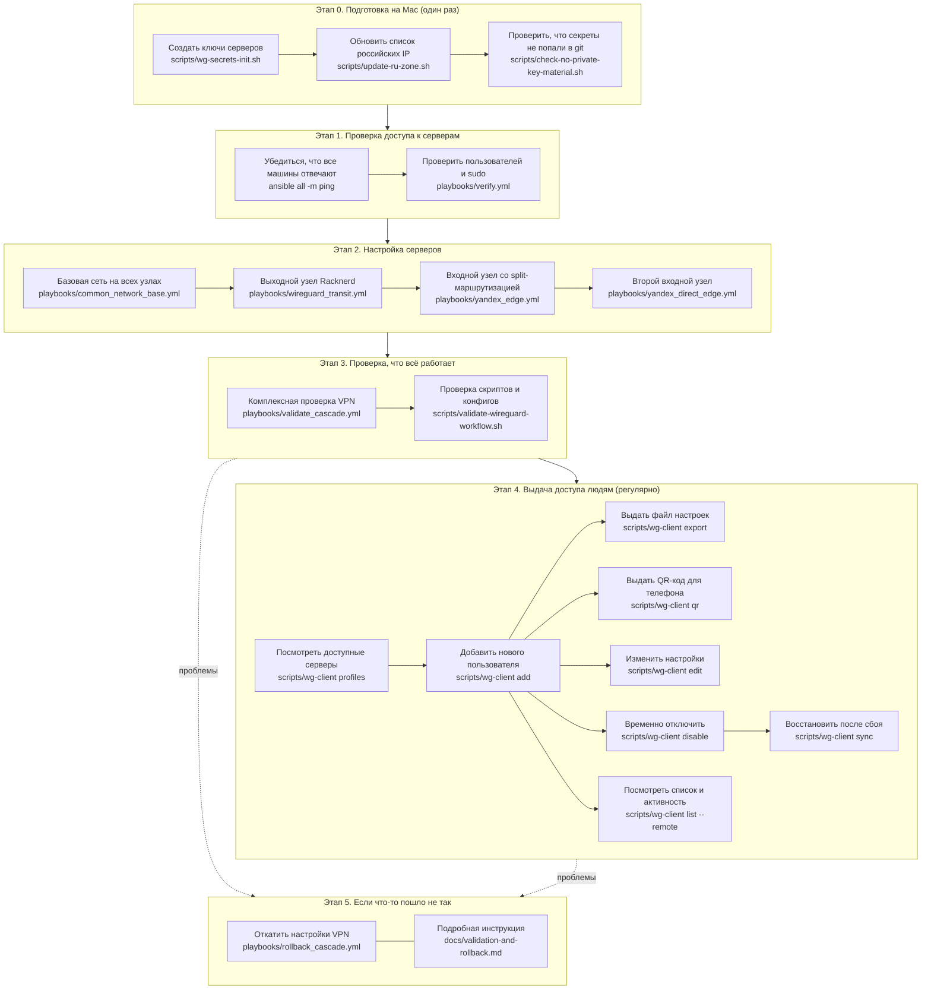

# Ansible Inventory

This directory contains the Ansible configuration for the prepared Ubuntu VPN hosts.

## Рабочий процесс

Ниже — схема всей работы с VPN: от первоначальной настройки до выдачи доступа сотрудникам. Команды сгруппированы по этапам; пояснения написаны простым языком.



### Этап 0. Подготовка на Mac

| Что делаем | Зачем (простыми словами) | Команда |
|------------|--------------------------|---------|
| Создаём ключи | Генерируем «замки и ключи» для серверов; хранятся только на вашем Mac, не в git | [`scripts/wg-secrets-init.sh`](scripts/wg-secrets-init.sh) |
| Обновляем список российских IP | Чтобы split-VPN знал, какой трафик оставлять в России, а какой отправлять за рубеж | [`scripts/update-ru-zone.sh`](scripts/update-ru-zone.sh) |
| Проверяем git | Убеждаемся, что секретные ключи случайно не попали в репозиторий | [`scripts/check-no-private-key-material.sh`](scripts/check-no-private-key-material.sh) |
| Генерируем первый конфиг клиента | Создаёт файл настроек для тестового подключения (устаревший путь; для новых клиентов удобнее `wg-client`) | [`playbooks/client_config.yml`](playbooks/client_config.yml) |

Подробнее о секретах: [`docs/secrets-and-client-config.md`](docs/secrets-and-client-config.md)

### Этап 1. Проверка доступа

| Что делаем | Зачем | Команда |
|------------|-------|---------|
| Пинг всех серверов | Проверяем, что Mac «видит» все машины по сети | `ansible all -m ping` |
| Проверка пользователей | Убеждаемся, что можно зайти и выполнять команды от имени администратора | [`playbooks/verify.yml`](playbooks/verify.yml) |

Проверка одной группы: `ansible yandex_edge -m ping`, `ansible external_vps -m ping`

### Этап 2. Настройка серверов

| Что делаем | Зачем | Команда |
|------------|-------|---------|
| Базовая сеть | Включаем пересылку трафика и базовый файрвол на всех узлах | [`playbooks/common_network_base.yml`](playbooks/common_network_base.yml) |
| Racknerd | Настраиваем зарубежный «выход» в интернет | [`playbooks/wireguard_transit.yml`](playbooks/wireguard_transit.yml) |
| Primary Yandex | Настраиваем главный вход: российский трафик — из Yandex, остальной — через Racknerd | [`playbooks/yandex_edge.yml`](playbooks/yandex_edge.yml) |
| Direct Yandex | Настраиваем второй вход: весь трафик через Racknerd | [`playbooks/yandex_direct_edge.yml`](playbooks/yandex_direct_edge.yml) |

Архитектура и схема трафика: [`docs/cascade-vpn-architecture.md`](docs/cascade-vpn-architecture.md)

### Этап 3. Проверка работоспособности

| Что делаем | Зачем | Команда |
|------------|-------|---------|
| Комплексная проверка | Автоматически проверяет VPN, маршруты, сервисы на всех узлах | [`playbooks/validate_cascade.yml`](playbooks/validate_cascade.yml) |
| Проверка скриптов | Убеждается, что локальные скрипты и конфиги в порядке | [`scripts/validate-wireguard-workflow.sh`](scripts/validate-wireguard-workflow.sh) |

### Этап 4. Выдача доступа сотрудникам

Ежедневная работа — через [`scripts/wg-client`](scripts/wg-client). Полная инструкция: [`docs/wg-client-admin.md`](docs/wg-client-admin.md)

| Что делаем | Зачем | Команда |
|------------|-------|---------|
| Список серверов | Показывает два входа: `primary` (split) и `direct` (полный выход) | `./scripts/wg-client profiles` |
| Добавить человека | Создаёт личный ключ, прописывает на сервере, выдаёт файл настроек | `./scripts/wg-client add <имя> --profile primary` |
| Файл настроек | Пересохраняет `.conf` для импорта в WireGuard | `./scripts/wg-client export <имя> --profile primary` |
| QR-код | Картинка для быстрого подключения с телефона | `./scripts/wg-client qr <имя> --profile primary` |
| Изменить настройки | Меняет DNS, MTU или IP и обновляет сервер | `./scripts/wg-client edit <имя> --profile primary` |
| Отключить | Временно закрывает доступ без удаления ключей | `./scripts/wg-client disable <имя> --profile primary` |
| Включить обратно | Возвращает доступ | `./scripts/wg-client enable <имя> --profile primary` |
| Список клиентов | Показывает всех, кого вы добавляли | `./scripts/wg-client list` |
| Кто сейчас подключён | Показывает активность на сервере | `./scripts/wg-client list --remote` |
| Показать конфиг | Выводит настройки в терминал | `./scripts/wg-client show-config <имя> --profile primary` |
| Восстановить | Переносит всех клиентов из реестра обратно на сервер | `./scripts/wg-client sync` |

### Этап 5. Откат при проблемах

| Что делаем | Зачем | Команда |
|------------|-------|---------|
| Откат VPN | Возвращает серверы к безопасному состоянию | [`playbooks/rollback_cascade.yml`](playbooks/rollback_cascade.yml) |
| Инструкция | Пошаговые действия при сбоях | [`docs/validation-and-rollback.md`](docs/validation-and-rollback.md) |

Все команды ниже выполняются из каталога `ansible`:

```sh
cd ansible
```

## Hosts

- `yc_ubuntu_2404_min`
  - Role: split-routing Russian entry node
  - Public IP: `51.250.14.221`
  - Internal IP: `10.128.0.24`
  - User: `deploy`
  - SSH key: `~/.ssh/yc_vm_ed25519`
  - Sudo: passwordless

- `yandex_wg_direct`
  - Role: simple Yandex entry node with Racknerd exit
  - Public IP: `89.169.158.239`
  - Internal IP: `10.128.0.22`
  - User: `yc-user`
  - SSH key: `~/.ssh/yc_vm_ed25519`
  - Sudo: passwordless

- `racknerd_ubuntu`
  - Role: Racknerd exit for both Yandex entry nodes
  - Public IP: `172.245.154.109`
  - User: `deploy`
  - SSH key: `~/.ssh/vps_172_245_154_109_ed25519`
  - Sudo: passwordless

## Документация

- Архитектура VPN: [`docs/cascade-vpn-architecture.md`](docs/cascade-vpn-architecture.md)
- План автоматизации: [`docs/agent-orchestration-plan.md`](docs/agent-orchestration-plan.md)
- Управление клиентами: [`docs/wg-client-admin.md`](docs/wg-client-admin.md)
- Секреты и конфиги: [`docs/secrets-and-client-config.md`](docs/secrets-and-client-config.md)
- Проверка и откат: [`docs/validation-and-rollback.md`](docs/validation-and-rollback.md)

## Notes

Private keys and passwords are not stored in this repository. Host variables reference local secret paths under `~/.config/vpn-gen/`.
