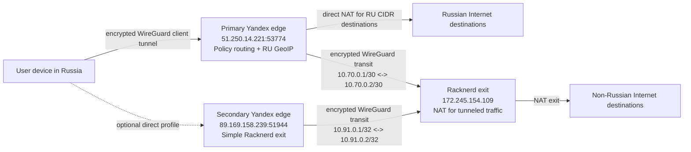

# Cascade VPN Architecture

## Goal

Build a two-hop VPN for owned infrastructure:

- A user in Russia connects to WireGuard on the Yandex Cloud VM.
- The Yandex VM is the entry and routing policy node.
- Russian destinations exit directly from Yandex Cloud.
- Non-Russian destinations are forwarded through an encrypted WireGuard transit tunnel to the Racknerd VM and exit from Racknerd.
- Traffic between Yandex Cloud and Racknerd is always encrypted.

This design is intended for legitimate administration, privacy, and resilient access on infrastructure you control.

## Current Hosts

- Primary Yandex Cloud edge:
  - Ansible host: `yc_ubuntu_2404_min`
  - Role: split-routing Russian entry node
  - Public IP: `51.250.14.221`
  - Internal IP: `10.128.0.24`
  - OS: Ubuntu 24.04
  - SSH user: `deploy`

- Secondary Yandex Cloud edge:
  - Ansible host: `yandex_wg_direct`
  - Role: simple client entry node with Racknerd exit, no RU split
  - Public IP: `89.169.158.239`
  - Internal IP: `10.128.0.22`
  - OS: Ubuntu 24.04
  - SSH user: `yc-user`

- Racknerd exit:
  - Ansible host: `racknerd_ubuntu`
  - Public IP: `172.245.154.109`
  - OS: Ubuntu 24.04
  - SSH user: `deploy`

## Logical Topology



## Address Plan

- Client VPN network: `10.60.0.0/24`
  - Yandex client WireGuard interface: `10.60.0.1/24`
  - Initial client example: `10.60.0.10/32`
  - Current fresh client example: `10.60.0.11/32`

- Primary Yandex-to-Racknerd transit network: `10.70.0.0/30`
  - Yandex transit WireGuard interface: `10.70.0.1/30`
  - Racknerd transit WireGuard interface: `10.70.0.2/30`

- Secondary Yandex direct client network: `10.80.0.0/24`
  - Secondary Yandex client WireGuard interface: `10.80.0.1/24`
  - Direct client example: `10.80.0.10/32`

- Secondary Yandex-to-Racknerd transit network: `10.91.0.0/32` style point-to-point addresses
  - Secondary Yandex transit WireGuard interface: `10.91.0.1/32`
  - Racknerd direct-exit WireGuard interface: `10.91.0.2/32`

- Routing policy table for non-RU traffic on Yandex: table `200`
  - Default route: `default dev wg-transit table 200`
  - Rule: marked packets `fwmark 0x2` use table `200`

- Routing policy table for the secondary Yandex direct node: table `210`
  - Default route: `default dev wg-transit table 210`
  - Rule: packets from `10.80.0.0/24` use table `210`

## WireGuard Interfaces

### Primary Yandex Cloud Edge

- `wg-client`
  - Listens for user devices.
  - Public endpoint: `51.250.14.221:53774`
  - Address: `10.60.0.1/24`
  - Peers: user devices, each with a `/32` client address.

- `wg-transit`
  - Encrypted tunnel to Racknerd.
  - Address: `10.70.0.1/30`
  - Peer: Racknerd `172.245.154.109:51821`
  - `Table = off`, because routes are managed explicitly by Ansible.
  - Racknerd peer `AllowedIPs` on Yandex can include `0.0.0.0/0`, but automatic route injection must stay disabled.

### Secondary Yandex Direct Edge

- `wg0`
  - Listens for user devices.
  - Public endpoint: `89.169.158.239:51944`
  - Address: `10.80.0.1/24`
  - Peers: user devices, each with a `/32` client address.

- `wg-transit`
  - Encrypted tunnel to Racknerd `wg-direct-exit`.
  - Address: `10.91.0.1/32`
  - Listen port: `51945`
  - Peer: Racknerd `172.245.154.109:51946`
  - `Table = off`; table `210` routes all `10.80.0.0/24` client traffic to Racknerd.

### Racknerd

- `wg-transit`
  - Listens for Yandex transit.
  - Public endpoint: `172.245.154.109:51821`
  - Address: `10.70.0.2/30`
  - Yandex peer `AllowedIPs`: `10.70.0.1/32, 10.60.0.0/24`

- `wg-direct-exit`
  - Listens for the secondary Yandex direct edge.
  - Public endpoint: `172.245.154.109:51946`
  - Address: `10.91.0.2/32`
  - Secondary Yandex peer `AllowedIPs`: `10.91.0.1/32, 10.80.0.0/24`

## Routing Policy

Yandex is the decision point.

Traffic from `10.60.0.0/24` is classified:

- Destination is private, local, loopback, multicast, or Yandex/Racknerd control traffic:
  - Never send through Racknerd.
  - Handle locally or via the normal Yandex route.

- Destination is in the RU IPv4 CIDR set:
  - Exit directly from Yandex through the Yandex VM public interface.
  - Apply NAT on Yandex.

- Destination is not in the RU CIDR set:
  - Mark packet with `fwmark 0x2`.
  - Policy route via table `200` to `wg-transit`.
  - Racknerd applies NAT and exits to the public Internet.

This creates a fail-closed path for non-RU traffic: if `wg-transit` is down, marked traffic has no ordinary fallback through Yandex.

## Packet Flow

### RU destination

1. Client sends packet to `wg-client` on Yandex.
2. Yandex checks destination IP against `ru4` nftables set.
3. Packet remains unmarked.
4. Packet exits via Yandex public interface with masquerade NAT.
5. Remote service sees Yandex public IP.

### Non-RU destination

1. Client sends packet to `wg-client` on Yandex.
2. Yandex checks destination IP and does not find it in `ru4`.
3. Yandex marks packet with `fwmark 0x2`.
4. Linux policy routing sends packet through `wg-transit`.
5. Racknerd receives source `10.60.0.0/24` traffic through WireGuard.
6. Racknerd applies masquerade NAT to its public interface.
7. Remote service sees Racknerd public IP.

## DNS Policy

Recommended default:

- Client devices use a DNS resolver on Yandex, e.g. `10.60.0.1`.
- The live primary Yandex edge runs `dnsmasq` bound to `wg-client` and `10.60.0.1`.
- Current upstreams are Yandex internal DNS `10.128.0.2` and `1.1.1.1`.
- `filter-AAAA` is enabled for the primary client resolver because the current client routing is IPv4-only.

Important limitation:

- Routing decisions are made by destination IP after DNS resolution.
- CDN-backed domains can return RU or non-RU addresses depending on resolver behavior.
- If domain-specific policy is later required, add a DNS-aware layer, but keep the first implementation IP-based.

## nftables Design

Yandex needs:

- `ru4` interval set with Russian IPv4 CIDRs.
- `bypass4` interval set for private/local/control destinations.
- Mangle chain to mark non-RU client packets:
  - Input interface: `wg-client`
  - Source: `10.60.0.0/24`
  - Destination not in `ru4`
  - Destination not in `bypass4`
  - Set mark `0x2`

- NAT chain:
  - `10.60.0.0/24` exiting Yandex public interface: masquerade.
  - Do not NAT traffic exiting `wg-transit`.

Racknerd needs:

- Forward `10.60.0.0/24` from `wg-transit` to public interface.
- Masquerade `10.60.0.0/24` on the public interface.
- Forward `10.80.0.0/24` from `wg-direct-exit` to public interface.
- Masquerade `10.80.0.0/24` on the public interface.

## GeoIP RU CIDR Updates

The live Ansible role reads the RU CIDR list from the controller at
`~/.config/vpn-gen/geo/ru.zone` and renders it into the `ru4` nftables interval
set. Refresh the controller cache with:

```sh
ansible/scripts/update-ru-zone.sh
```

A future hardening step can move this to a systemd timer on Yandex:

- Download an IPv4 RU zone source.
- Validate syntax.
- Convert to an nftables include file.
- Atomically reload the nft set.
- Keep the previous working set as fallback.

Initial source candidate:

- `https://www.ipdeny.com/ipblocks/data/countries/ru.zone`

The role should make the source configurable so it can be replaced with RIPE/MaxMind-derived data later.

## Security Controls

- Keep SSH restricted to key-based `deploy` access.
- Use separate WireGuard keys for:
  - User clients.
  - Yandex-to-Racknerd transit.
- Store private keys outside git.
- Use Ansible Vault or local files ignored by git for secrets.
- Add a firewall allowlist:
  - SSH from operator IPs if stable.
  - WireGuard client UDP port on Yandex.
  - WireGuard transit UDP port on Racknerd.
  - Established/related traffic.
- Disable automatic route injection on `wg-transit` with `Table = off`.
- Add explicit routes and rules through Ansible.
- Avoid fallback from non-RU traffic to Yandex if transit is unavailable.

## Operational Checks

From Ansible:

- `ansible all -m ping`
- `ansible-playbook playbooks/verify.yml`
- Verify WireGuard status:
  - `wg show`
  - latest handshakes
  - transfer counters

From a test client:

- RU destination should show Yandex exit IP.
- Non-RU destination should show Racknerd exit IP.
- Stop Racknerd `wg-transit`; non-RU traffic should fail, not fall back to Yandex.
- RU traffic should continue through Yandex while Racknerd transit is down.

## Out of Scope for First Implementation

- Domain-based routing.
- IPv6 routing.
- Multi-client self-service portal.
- Automatic mobile config distribution.
- Obfuscation transports outside WireGuard.
