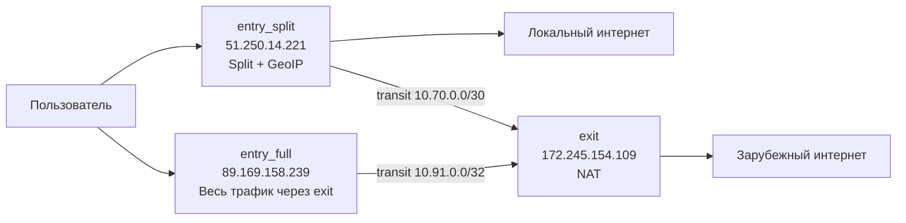

# Архитектура каскадного VPN

## Цель

Двухступенчатый VPN на собственной инфраструктуре:

- пользователь подключается по WireGuard к **entry**-узлу;
- entry — точка входа и политики маршрутизации;
- «локальный» трафик (для РФ — адреса из GeoIP) выходит напрямую с entry;
- остальной трафик идёт через зашифрованный transit-туннель на **exit** и выходит в интернет оттуда;
- канал entry ↔ exit всегда зашифрован WireGuard.

## Текущие хосты (reference-деплой yandex-racknerd)

| Хост | Роль | IP | SSH |
|------|------|-----|-----|
| `entry_split_01` | Split entry | `51.250.14.221` | `deploy` |
| `entry_full_01` | Full entry | `89.169.158.239` | `yc-user` |
| `exit_01` | Exit | `172.245.154.109` | `deploy` |

Подробности провайдера: [`deployments/yandex-racknerd/README.md`](../deployments/yandex-racknerd/README.md).

## Логическая схема



## План адресов

| Сеть | Назначение |
|------|------------|
| `10.60.0.0/24` | Клиенты split lane 1 (`10.60.0.1` — сервер, exit_01) |
| `10.61.0.0/24` | Клиенты split lane 2 (`10.61.0.1` — сервер, exit_02) |
| `10.70.0.0/30` | Transit split ↔ exit_01 (`10.70.0.1` / `10.70.0.2`) |
| `10.71.0.0/30` | Transit split lane 2 ↔ exit_02 (`10.71.0.1` / `10.71.0.2`) |
| `10.80.0.0/24` | Клиенты full entry (`10.80.0.1` — сервер) |
| `10.91.0.0/32` | Transit full ↔ exit (`10.91.0.1` / `10.91.0.2`) |
| table `200` | Policy routing lane 1: `fwmark 0x2` → `wg-transit` |
| table `201` | Policy routing lane 2: `fwmark 0x4` → `wg-transit-2` |
| table `210` | Policy routing full: трафик `10.80.0.0/24` → `wg-transit` |

Порты (reference): split клиенты `53774`, transit split `51821`, full клиенты `51944`, transit full `51945`, exit full `51946`.

## Интерфейсы WireGuard

### entry_split

### entry_split (dual-exit reference)

- **wg-client** — lane 1; `:53774`; `10.60.0.1/24`; exit_01
- **wg-client-2** — lane 2; `:54774`; `10.61.0.1/24`; exit_02
- **wg-transit** — tunnel на exit_01; `10.70.0.1/30`
- **wg-transit-2** — tunnel на exit_02; `10.71.0.1/30`

Lane group `split`: один пользователь, один ключ, два конфига. Адрес зеркалируется по host-октету: `10.60.0.N` ↔ `10.61.0.N`. Отдельные подсети устраняют конфликт маршрутов и DNS на entry.

### entry_split (single-exit)

- **wg-client** — клиенты; endpoint split entry; адрес `10.60.0.1/24`
- **wg-transit** — tunnel на exit; `10.70.0.1/30`; peer exit `:51821`; `Table = off`

### entry_full

- **wg0** — клиенты; endpoint `89.169.158.239:51944`; адрес `10.80.0.1/24`
- **wg-transit** — tunnel на `wg-exit-full` exit; `10.91.0.1/32`; порт `51945`

### exit

- **wg-transit** — от split entry lane 1; `:51821`; `10.70.0.2/30`; AllowedIPs: `10.70.0.1/32, 10.60.0.0/24`
- **wg-transit (exit_02)** — от split entry lane 2; `:51821`; `10.71.0.2/30`; AllowedIPs: `10.71.0.1/32, 10.61.0.0/24`
- **wg-exit-full** — от full entry; `:51946`; `10.91.0.2/32`; AllowedIPs: `10.91.0.1/32, 10.80.0.0/24`

## Политика маршрутизации (split)

Трафик из `10.60.0.0/24` классифицируется на entry:

1. **Bypass** — private/local/control: не отправлять на exit
2. **RU CIDR (ru4)** — выход с публичного интерфейса entry + masquerade
3. **Остальное** — mark `0x2` → table `200` → `wg-transit` → exit + NAT

Если transit недоступен, немarkированный «зарубежный» трафик **не** должен «проскочить» напрямую с entry (fail-closed).

## Поток пакетов

**Локальный (RU) destination:** клиент → wg-client → ru4 match → NAT на entry → виден IP entry.

**Зарубежный destination:** клиент → wg-client → не в ru4 → mark 0x2 → wg-transit → exit NAT → виден IP exit.

## DNS

- Клиентам lane 1: DNS `10.60.0.1`; lane 2: DNS `10.61.0.1`.
- На entry: `dnsmasq` на `wg-client` + `wg-client-2`, upstream из `entry_split_dns_upstreams`, `filter-AAAA`.
- Маршрутизация по **IP после DNS**; CDN могут отдавать разные адреса — это ограничение IP-based split.

## nftables

**entry_split:** interval-set `ru4`, bypass-set, mangle (mark 0x2), masquerade для локального выхода клиентов.

**exit:** forward + masquerade для `10.60.0.0/24` (wg-transit) и `10.80.0.0/24` (wg-exit-full).

## Обновление списка RU CIDR

Кэш на Mac: `~/.config/vpn-gen/geo/ru.zone`. Обновление:

```sh
ansible/scripts/update-ru-zone.sh
```

Ansible-роль читает файл с контроллера и рендерит set `ru4`.

## Безопасность

- SSH только по ключам
- Отдельные ключи: клиенты / transit
- Секреты вне git
- Firewall: SSH, UDP WireGuard, established/related
- `Table = off` на transit — маршруты только явно через Ansible

## Операционные проверки

```sh
ansible all -m ping
ansible-playbook playbooks/verify.yml
ansible-playbook playbooks/validate_cascade.yml
```

С клиента: RU → IP entry; non-RU → IP exit; при падении exit transit non-RU не работает, RU — работает.

## Вне scope первой версии

- маршрутизация по доменам;
- IPv6;
- self-service портал;
- обфускация поверх WireGuard.
