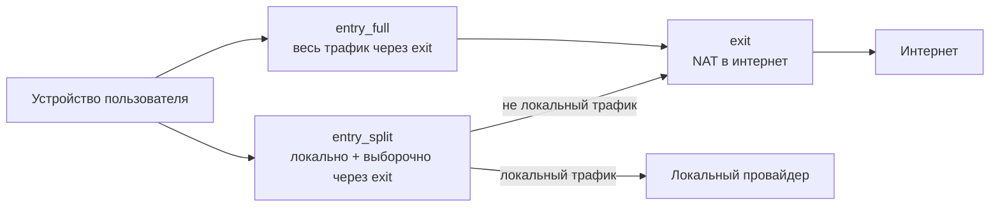

# План имён и развёртывания

## Цель

Превратить репозиторий в **переносимый набор для каскадного VPN**, который можно развернуть с любыми облачными entry-узлами и любым exit-VPS. Имена провайдеров не должны фигурировать в ролях, плейбуках и общей документации.

## Концептуальная топология

## Таблица имён (реализовано)

| Было (привязка к провайдеру) | Стало (концепция) |
|------------------------------|-------------------|
| роль / группа `yandex_edge` | `entry_split` |
| `yandex_direct_edge` | `entry_full` |
| `racknerd_exit` | `exit` |
| переменные `yandex_edge_*` | `entry_split_*` |
| `yandex_direct_*` | `entry_full_*` |
| `racknerd_exit_*` | `exit_*` |
| peer-переменные `*_racknerd_*` | `*_exit_*` |
| профиль wg-client `primary` | `split` |
| профиль wg-client `direct` | `full` |
| хост `yc_ubuntu_2404_min` | `entry_split_01` |
| хост `yandex_wg_direct` | `entry_full_01` |
| хост `racknerd_ubuntu` | `exit_01` |

Для совместимости сохранены алиасы wg-client: `primary` → `split`, `direct` → `full`.

## Что остаётся специфичным для деплоя

Эти данные живут в `inventory/host_vars/`, `deployments/<имя>/` или README деплоя — **не** в ролях:

- публичные и внутренние IP;
- SSH-пользователи и пути к ключам;
- метаданные облака (`cloud_instance_id`, регион, зона);
- публичные ключи WireGuard и endpoint'ы;
- DNS-upstream, привязанный к облаку (например резолвер `10.128.0.2`);
- абсолютные пути под `~/.config/vpn-gen/` на Mac оператора.

Текущий живой частный случай описан в деплое **yandex-racknerd**: [`deployments/yandex-racknerd/README.md`](../deployments/yandex-racknerd/README.md).

## Инструменты автоматизации

| Шаг | Инструмент | Универсальный? |
|-----|------------|----------------|
| Генерация ключей серверов | `scripts/wg-secrets-init.sh` | Да |
| Кэш российских CIDR | `scripts/update-ru-zone.sh` | Да — код страны через env |
| Базовая сеть | `playbooks/common_network_base.yml` | Да |
| Exit-узел | `playbooks/exit.yml` | Да |
| Split entry | `playbooks/entry_split.yml` | Да |
| Full entry | `playbooks/entry_full.yml` | Да |
| Проверка | `playbooks/validate_cascade.yml` | Да |
| Откат | `playbooks/rollback_cascade.yml` | Да |
| Клиенты + QR | `scripts/wg-client` | Да — профили из JSON/YAML |
| Самопроверка скриптов | `scripts/validate-wireguard-workflow.sh` | Да |

## Профили клиентов

`wg-client` читает `deployments/<VPN_GEN_DEPLOYMENT>/client-profiles.json` (или `.yml`). Шаблон: [`deployments/reference/client-profiles.json`](../deployments/reference/client-profiles.json).

## Миграция со старых имён

1. Имена ролей и переменных в git уже универсальны; серверы не требуют изменений до повторного запуска плейбуков.
2. **Имена файлов секретов** на Mac можно не менять — укажите реальные пути в `*_private_key_path` в host_vars (в yandex-racknerd до сих пор используются legacy-имена вроде `yandex_wg_client.private.key`).
3. При желании переименуйте ключи под новые ID и выполните `./scripts/wg-secrets-init.sh --check`.
4. Каталоги реестра wg-client: `primary/` → `split/`, `direct/` → `full/` (необязательно — алиасы работают).
5. После повторного ansible-playbook на серверах появятся новые nftables-фрагменты (`entry_split.nft`, `exit_split.nft`, `exit_full.nft`) вместо старых имён провайдеров.
6. Если плейбук перезаписал WireGuard-конфиги — восстановите клиентов: `./scripts/wg-client sync`.

## Планы на будущее

- генератор inventory из одного `deployment.yml`;
- второй exit для отказоустойчивости;
- шаблон host_vars с Ansible Vault;
- CI-проверка: строки провайдеров только внутри `deployments/`.
