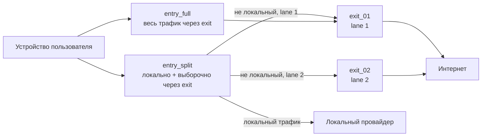

# План имён и развёртывания

## Цель

Превратить репозиторий в **переносимый набор для каскадного VPN**, который можно развернуть с любыми облачными entry-узлами и любым exit-VPS. Имена провайдеров не должны фигурировать в ролях, плейбуках и общей документации.

## Концептуальная топология

## Таблица имён (реализовано)

| Было (привязка к провайдеру) | Стало (концепция) |
|------------------------------|-------------------|
| роль / группа `yandex_edge` | `entry_split` |
| `yandex_direct_edge` | `entry_full` |
| `racknerd_exit` | `exit` / `exit_01`, `exit_02` |
| переменные `yandex_edge_*` | `entry_split_*` |
| `yandex_direct_*` | `entry_full_*` |
| `racknerd_exit_*` | `exit_*` |
| peer-переменные `*_racknerd_*` | `*_exit_*` |
| профиль wg-client `primary` | `split` |
| профиль wg-client `direct` | `full` |
| профиль wg-client (lane 2) | `split2` |
| хост `yc_ubuntu_2404_min` | `entry_split_01` |
| хост `yandex_wg_direct` | `entry_full_01` |
| хост `racknerd_ubuntu` | `exit_01` |
| — | `exit_02` (второй exit) |

Алиасы wg-client: `primary` → `split`, `direct` → `full`.

Lane group `split`: профили `split` + `split2` — один ключ, зеркальные IP `10.60.0.N` / `10.61.0.N`.

## Что остаётся специфичным для деплоя

Эти данные живут в `inventory/host_vars/`, `deployments/<имя>/` или README деплоя — **не** в ролях:

- публичные и внутренние IP;
- SSH-пользователи и пути к ключам;
- метаданные облака (провайдер, регион);
- публичные ключи WireGuard и endpoint'ы;
- DNS-upstream (`1.1.1.1` / `8.8.8.8` на cloud.ru), имя публичного интерфейса (`enp3s0`, `ens3`, `eth0`);
- `entry_split_dual_exit_enabled`, transit listen-порты (`49251` / `49249` на reference cloud.ru);
- абсолютные пути под `~/.config/vpn-gen/` на Mac оператора.

Текущий живой частный случай: [`deployments/yandex-racknerd/README.md`](../deployments/yandex-racknerd/README.md) (split entry на cloud.ru, full на Yandex, exit_01 Racknerd, exit_02 VPS).

## Инструменты автоматизации

| Шаг | Инструмент | Универсальный? |
|-----|------------|----------------|
| Генерация ключей серверов | `scripts/wg-secrets-init.sh` | Да (+ dual-exit ключи вручную) |
| Кэш российских CIDR | `scripts/update-ru-zone.sh` | Да |
| Базовая сеть | `playbooks/common_network_base.yml` | Да |
| Exit-узлы | `playbooks/exit.yml` | Да (`exit_01`, `exit_02`) |
| Split entry | `playbooks/entry_split.yml` | Да (single / dual-exit) |
| Full entry | `playbooks/entry_full.yml` | Да |
| Проверка | `playbooks/validate_cascade.yml` | Да |
| Откат | `playbooks/rollback_cascade.yml` | Да |
| Клиенты + QR | `scripts/wg-client` | Да — профили `split`, `split2`, `full` |

## Профили клиентов

`wg-client` читает `deployments/<VPN_GEN_DEPLOYMENT>/client-profiles.json`. Шаблон: [`deployments/reference/client-profiles.json`](../deployments/reference/client-profiles.json).

## Миграция со старых имён / single-exit

1. Имена ролей и переменных в git уже универсальны.
2. **Имена файлов секретов** на Mac можно не менять — укажите пути в `*_private_key_path`.
3. При переходе на dual-exit: сгенерируйте ключи lane 2, включите `entry_split_dual_exit_enabled`, задеплойте `exit_02`.
4. Клиенты lane 2: `./scripts/wg-client sync --profile split` (создаст mirror-записи `split2:*`).
5. После `entry_split.yml` — всегда `./scripts/wg-client sync --profile split`.
6. nftables handler: `nft -f /etc/nftables.conf` (не reload service).

## Планы на будущее

- генератор inventory из одного `deployment.yml`;
- `wg-secrets-init.sh`: автогенерация ключей lane 2 / exit_02;
- шаблон host_vars с Ansible Vault;
- CI: строки провайдеров только внутри `deployments/`.
