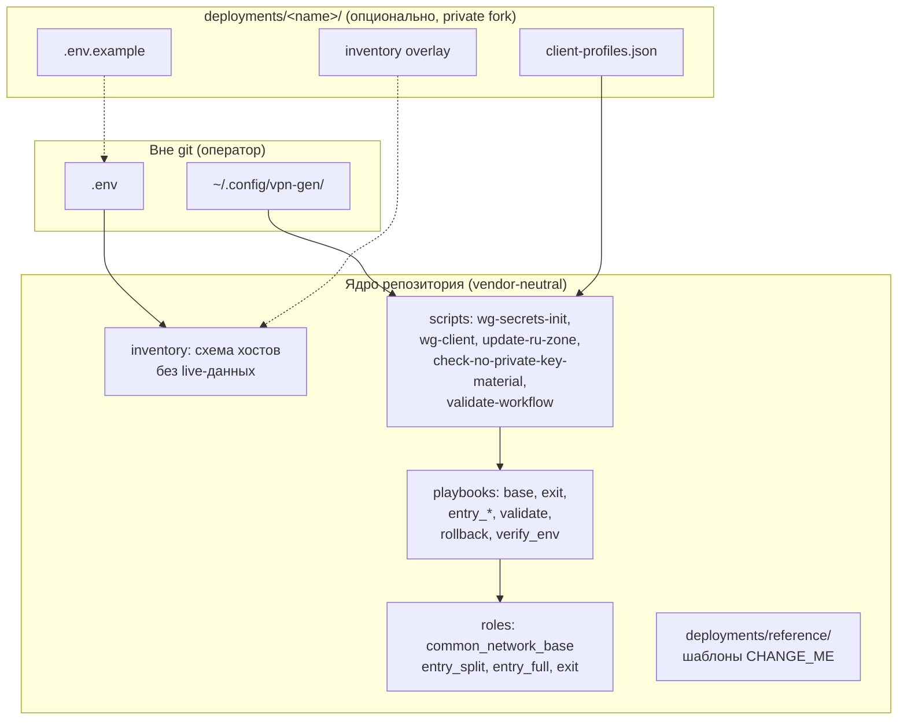
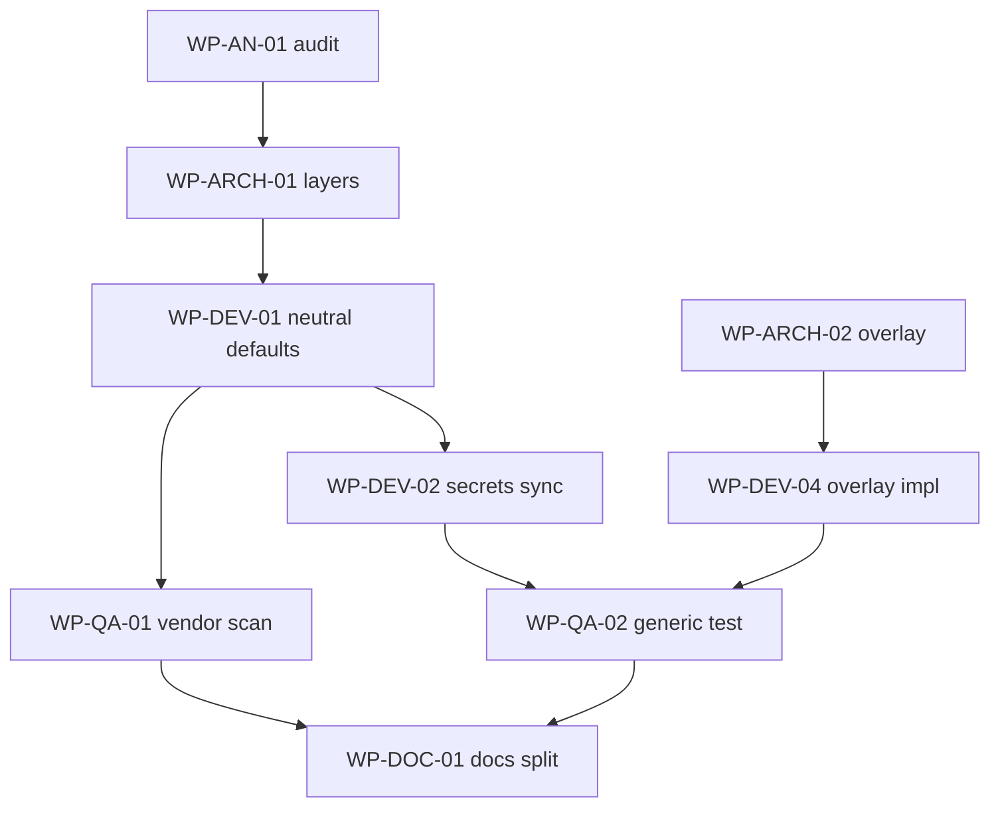

# Задание: vpn-gen v2 (чистая версия без рудиментов)

**Статус:** черновик ТЗ для разработки  
**Базовая ветка:** `feat/env-config-and-verify` / `main` после merge PR #1  
**Целевая ветка:** `v2` (или `main` после major release)  
**Язык артефактов:** русский (документация), английский (имена ролей/переменных/файлов — как сейчас)

> **Уже реализовано в v1** (не ждёт v2): dual-exit split (`wg-client-2`, `wg-transit-2`, `exit_02`, профиль `split2`, lane group в `wg-client`). См. [cascade-vpn-architecture.md](cascade-vpn-architecture.md).

---

## 1. Цель

Собрать **vpn-gen v2** — минимальный, переносимый набор для каскадного WireGuard VPN, в котором:

- в **ядре репозитория** нет имён провайдеров, облачных пользователей (`yc-user`), legacy-алиасов и **публичных IP**;
- конфигурация окружения задаётся **одним предсказуемым контрактом** (deployment + `.env`);
- остаются только блоки, без которых нельзя развернуть или сопровождать VPN;
- документация и проверки пригодны для **оркестрации агентами** и параллельной работы аналитиков, архитекторов, разработчиков, тестировщиков и технических писателей.

### 1.1. Не-цели (out of scope v2)

- Поддержка Windows/Linux контроллера (остаётся macOS + Ansible).
- GUI, панель управления, биллинг.
- Multi-exit HA, автоматический failover.
- Миграционные скрипты с v0/v1 имён провайдеров (достаточно архивной заметки в CHANGELOG).
- Хранение live-секретов и IP в git (даже в «reference»).

---

## 2. Принципы v2

| ID | Прinciple | Проверка |
|----|-----------|----------|
| P1 | **Vendor-neutral core** | `rg -i 'yandex|racknerd|yc-user|yc_vm|ru-central1' ansible/{roles,playbooks,inventory,scripts}` → 0 совпадений (кроме `deployments/` и `docs/archive/`) |
| P2 | **No public IPs in core** | `rg '\b([0-9]{1,3}\.){3}[0-9]{1,3}\b' ansible/{roles,playbooks,inventory,scripts,docs}` → только RFC5737 (`203.0.113.0/24`, `198.51.100.0/24`, `192.0.2.0/24`) и private CIDR из §4.2 |
| P3 | **Single source of truth** | Каждый параметр окружения имеет ровно один канонический источник (см. §5) |
| P4 | **Fail-closed** | При недоступном exit non-local трафик не уходит напрямую с entry_split |
| P5 | **Secrets outside git** | Приватные ключи только на controller; CI сканирует утечки |
| P6 | **Idempotent apply** | Второй прогон плейбука без лишних `changed` |
| P7 | **Testable without live infra** | Generic dry-run проходит без SSH к реальным серверам |

---

## 3. Целевая архитектура (только необходимые блоки)



### 3.1. Обязательные компоненты ядра

| Блок | Назначение | Оставить |
|------|------------|----------|
| `roles/common_network_base` | forward, базовый nftables, пакеты | да |
| `roles/exit` | wg-transit, NAT, опционально wg-exit-full | да |
| `roles/entry_split` | wg-client, wg-transit, GeoIP split, dnsmasq | да |
| `roles/entry_full` | wg0, wg-transit → exit | да (опциональный узел) |
| `playbooks/verify_env.yml` | локальная проверка .env + inventory | да |
| `playbooks/verify.yml` | SSH + sudo + `ansible_user` | да |
| `playbooks/validate_cascade.yml` | E2E проверки на серверах | да |
| `playbooks/rollback_cascade.yml` | откат | да |
| `scripts/wg-client` | управление клиентами | да |
| `scripts/wg-secrets-init.sh` | ключи серверов | да |
| `scripts/update-ru-zone.sh` | GeoIP split | да |
| `scripts/validate-workflow.sh` | единая точка CI/smoke | да (слить с dry-run) |
| `deployments/reference/` | шаблоны с `CHANGE_ME` | да |

### 3.2. Удалить или объединить (рудименты)

| Артефакт | Причина удаления | Замена |
|----------|------------------|--------|
| `playbooks/client_config.yml` + `templates/client/initial-client.conf.j2` | дублирует `wg-client add` | только `wg-client` |
| `deployments/*/client-profiles.yml` | дублирует JSON | только JSON |
| `PROFILE_ALIASES` (`primary`/`direct`) в wg-client | legacy миграция | только `split`/`full` |
| `docs/naming-and-deployment-plan.md` | миграция v0→v1 выполнена | `docs/archive/` или CHANGELOG |
| `docs/agent-orchestration-plan.md` | план M1–M4 выполнен | §8 этого ТЗ |
| `scripts/dry-run-user-journey.sh` (ветка yandex-racknerd) | live SSH в generic CI | один generic dry-run + deployment README |
| `host_notes`, cloud metadata в inventory | документация в vars | deployment README |
| Live WG peers/keys в `inventory/host_vars/` | утечка live-состояния | deployment overlay или `wg-client sync` |
| Default имена ключей `yandex_*`, `racknerd_*` | vendor в core | нейтральные имена (§5.3) |
| DNS `10.128.0.2` в role defaults | Yandex metadata | env / host_vars `entry_split_dns_upstreams` (v1 reference: `1.1.1.1`, `8.8.8.8`) |
| `inventory/group_vars/all/main.yml` `ansible_user: deploy` | дублирует group_vars + env | только per-group env |
| Дубли `ansible.cfg` `remote_user` | см. выше | один механизм |

### 3.3. Вынести из ядра в private deployment

Весь каталог `deployments/yandex-racknerd/` (и любые live-деплои):

- реальные IP, SSH-ключи, `yc-user`, публичные WG-ключи;
- **не коммитить** в публичный upstream или держать в отдельном private fork;
- в upstream — только `deployments/reference/` с placeholders.

---

## 4. Контракт конфигурации v2

### 4.1. Слои

| Слой | Файл | Содержимое |
|------|------|------------|
| L0 Schema | `inventory/hosts.yml` | имена групп/хостов, Jinja на env |
| L1 Defaults | `inventory/group_vars/all/{main,controller,deployment}.yml` | пути, порты, defaults без IP |
| L2 Environment | `ansible/.env` (gitignore) | IP, SSH users, ключи, flags |
| L3 Deployment | `deployments/<name>/` | client-profiles.json, optional inventory overlay |
| L4 Secrets | `~/.config/vpn-gen/` | private keys, wg-client registry |

### 4.2. Сетевые константы (допустимы в core)

Это **архитектурные** адреса, не привязка к провайдеру:

| Сеть | Назначение |
|------|------------|
| `10.60.0.0/24` | split clients |
| `10.70.0.0/30` | split transit entry↔exit |
| `10.80.0.0/24` | full clients |
| `10.91.0.0/32` | full transit (point-to-point) |
| Policy tables `200` / `210` | split / full |

Вынести в один файл `inventory/group_vars/all/networks.yml` (или `defaults/networks.yml` в roles meta) — **единый источник**.

### 4.3. Имена файлов ключей (нейтральные defaults)

| Назначение | v2 default filename |
|------------|---------------------|
| entry_split wg-client | `entry_split_wg_client.private.key` |
| entry_split wg-transit | `entry_split_wg_transit.private.key` |
| exit wg-transit | `exit_wg_transit.private.key` |
| entry_full wg-client | `entry_full_wg_client.private.key` |
| entry_full wg-transit | `entry_full_wg_transit.private.key` |
| exit wg-exit-full | `exit_entry_full_wg.private.key` |

`wg-secrets-init.sh` и `controller.yml` **должны совпадать** (сейчас расхождение — bug v1).

### 4.4. Переменные окружения (канонический набор)

Обязательные:

- `VPN_GEN_ENTRY_SPLIT_HOST`
- `VPN_GEN_EXIT_HOST`
- `VPN_GEN_ENTRY_SPLIT_SSH_USER` (default `deploy`)
- `VPN_GEN_EXIT_SSH_USER` (default `deploy`)
- `VPN_GEN_SSH_KEY_ENTRY`
- `VPN_GEN_SSH_KEY_EXIT`

Опциональные:

- `VPN_GEN_ENTRY_FULL_HOST`, `VPN_GEN_ENTRY_FULL_SSH_USER`
- `VPN_GEN_EXIT_ENTRY_FULL_ENABLED` (`false` по умолчанию)
- `VPN_GEN_WG_*`, `VPN_GEN_RU_ZONE_*`, `VPN_GEN_DEPLOYMENT`

Запрещено в `.env.example` ядра: реальные IP, имена провайдеров, cloud-only users.

---

## 5. Карта зачистки (inventory audit)

### 5.1. Текущие нарушения P1/P2 в core (исправить в v2)

| Место | Проблема |
|-------|----------|
| `controller.yml` | defaults `yandex_*`, `racknerd_*` |
| `entry_split/defaults/main.yml` | `10.128.0.2`, exit IP в bypass |
| `wg-client-admin.py` | default deployment `yandex-racknerd` |
| `verify_env.yml` | упоминание `yc-user`, `yandex-racknerd` |
| `host_vars/*` | live WG public keys, test peers |
| `README.md`, `docs/*` | live IP, провайдеры в tutorial |
| `deployments/yandex-racknerd/*` в public repo | live infra (→ private fork) |

### 5.2. Целевое состояние inventory

```
inventory/
  hosts.yml                 # только Jinja {{ vpn_gen_* }}
  group_vars/all/
    main.yml                # become, без ansible_user
    controller.yml            # пути, neutral key names
    deployment.yml            # env lookups
    networks.yml              # NEW: CIDR constants
  group_vars/
    entry_split.yml
    entry_full.yml
    exit.yml
  host_vars/                # ПУСТО или example с CHANGE_ME
```

Live-данные:

```
deployments/<private-name>/
  .env.example
  client-profiles.json
  inventory/host_vars/      # overlay (ansible -i inventory -i overlay)
```

---

## 6. Work packages для оркестра агентов

Формат: `[ID] Название — роли — зависимости — DoD`

### 6.1. Архитектор

| ID | Задача | DoD |
|----|--------|-----|
| **WP-ARCH-01** | Утвердить §3–§5, frozen network constants | ADR в `docs/adr/001-v2-config-layers.md` |
| **WP-ARCH-02** | Спроектировать deployment overlay (multi `-i`) | схема каталогов + пример `ansible.cfg` snippet |
| **WP-ARCH-03** | Политика private vs public repo | README: что в upstream, что в fork |

### 6.2. Аналитик

| ID | Задача | DoD |
|----|--------|-----|
| **WP-AN-01** | Инвентаризация всех вхождений P1/P2 | CSV/таблица: file, line, class, action |
| **WP-AN-02** | Матрица «компонент → источник config» | нет параметра с двумя источниками |
| **WP-AN-03** | User journeys v2 | 3 сценария: split+exit, +full, generic VPS |

### 6.3. Системный программист (Ansible/roles)

| ID | Задача | Зависит от | DoD |
|----|--------|------------|-----|
| **WP-DEV-01** | Нейтрализовать `controller.yml`, role defaults | ARCH-01 | P1 scan clean |
| **WP-DEV-02** | Синхронизировать `wg-secrets-init` ↔ key filenames | DEV-01 | `--check` OK на fresh install |
| **WP-DEV-03** | DNS upstream через env | ARCH-01 | нет `10.128.0.2` в roles |
| **WP-DEV-04** | Deployment inventory overlay | ARCH-02 | yandex live данные только в overlay |
| **WP-DEV-05** | Удалить `client_config.yml` path | AN-02 | docs/scripts не ссылаются |
| **WP-DEV-06** | Убрать wg-client aliases | AN-02 | `primary`/`direct` → error с hint |
| **WP-DEV-07** | Rename route table `wg_direct` → neutral | DEV-01 | validate playbook updated |
| **WP-DEV-08** | `wg-client-admin.py` default `reference` | DEV-01 | — |
| **WP-DEV-09** | Слить validate + dry-run → `scripts/test.sh` | QA-01 | один entrypoint |

### 6.4. Тестировщик

| ID | Задача | DoD |
|----|--------|-----|
| **WP-QA-01** | CI gate: `scripts/check-vendor-neutral.sh` | exit 1 при P1/P2 нарушении в core |
| **WP-QA-02** | Generic dry-run без SSH | `./scripts/test.sh --profile generic` green |
| **WP-QA-03** | Playbook idempotence | 2× run validate changed=0 |
| **WP-QA-04** | Regression: split RU direct / non-RU via exit | manual checklist + optional molecule |
| **WP-QA-05** | Fail-closed test | stop exit transit → non-RU blocked |
| **WP-QA-06** | Secret leak scan | `check-no-private-key-material.sh` in CI |

### 6.5. Технический писатель

| ID | Задача | DoD |
|----|--------|-----|
| **WP-DOC-01** | README ≤150 строк + `docs/getting-started.md` | onboarding без vendor/IP |
| **WP-DOC-02** | Merge testing docs → `docs/testing.md` | удалить 2 thin testing files |
| **WP-DOC-03** | Archive migration docs | `docs/archive/v1-migration.md` |
| **WP-DOC-04** | Обновить `docs/README.md` index | ссылка на v2 spec |
| **WP-DOC-05** | Deployment author guide | как создать `deployments/my/` |

### 6.6. Оркестратор агентов

| ID | Задача | DoD |
|----|--------|-----|
| **WP-ORCH-01** | DAG выполнения WP | см. §7 |
| **WP-ORCH-02** | Шаблон handoff-отчёта агента | commands run, exit codes, blockers |
| **WP-ORCH-03** | Stop rules | любой FAIL в QA-01/06 → стоп цепочки |

---

## 7. Граф зависимостей (порядок для агентов)



**Рекомендуемые спринты:**

1. **Sprint A (foundation):** AN-01, ARCH-01, DEV-01, DEV-02, QA-01  
2. **Sprint B (structure):** ARCH-02, DEV-04, DEV-05..08, QA-02, QA-06  
3. **Sprint C (docs + hardening):** DOC-*, DEV-09, QA-03..05  
4. **Sprint D (release):** private deployment fork, tag `v2.0.0`

---

## 8. Критерии приёмки v2 (release gate)

Все пункты обязательны:

- [ ] **G1** P1 scan: 0 vendor strings в core  
- [ ] **G2** P2 scan: 0 non-RFC5737 public IPs в core docs/scripts/inventory  
- [ ] **G3** `./scripts/test.sh --profile generic` → exit 0  
- [ ] **G4** `ansible-playbook playbooks/verify_env.yml` на `.env.example` → exit 0  
- [ ] **G5** `validate-wireguard-workflow` / successor green  
- [ ] **G6** `check-no-private-key-material.sh` green  
- [ ] **G7** README onboarding использует только `VPN_GEN_*` и TEST-NET IPs  
- [ ] **G8** Нет `client_config.yml`, `client-profiles.yml`, aliases `primary`/`direct`  
- [ ] **G9** Live deployment (yandex-racknerd) работает из **private overlay**, не из core inventory  
- [ ] **G10** CHANGELOG v2.0.0 с breaking changes  

---

## 9. Контракт handoff между ролями

Каждый агент/исполнитель сдаёт **handoff.md**:

```markdown
## WP-XXX — статус: done|blocked

### Изменённые файлы
- path (reason)

### Команды проверки
+ command
  expected: ...

### Scan results
- vendor scan: PASS/FAIL
- ip scan: PASS/FAIL

### Blockers
- ...

### Следующему агенту
- ...
```

---

## 10. Автоматические проверки (реализовать в WP-QA-01)

### 10.1. `scripts/check-vendor-neutral.sh`

```bash
# Пример логики (не код prod)
VENDOR_PATTERN='yandex|racknerd|yc-user|yc_vm|ru-central1'
rg -i "$VENDOR_PATTERN" ansible/{roles,playbooks,inventory,scripts} && exit 1
```

Исключения: `deployments/`, `docs/archive/`, этот файл spec.

### 10.2. `scripts/check-no-public-ips.sh`

- Разрешить: RFC5737, private RFC1918, `10.60/70/80/91` constants  
- Запретить: всё остальное в core  

### 10.3. Единый `scripts/test.sh`

```bash
./scripts/test.sh --profile generic    # CI default
./scripts/test.sh --profile deployment # optional: needs DEPLOYMENT_PATH + SSH
```

---

## 11. Breaking changes для пользователей v1

| v1 | v2 |
|----|-----|
| `primary` / `direct` profiles | `split` / `full` only |
| `initial-client.conf` + `client_config.yml` | `wg-client add` |
| Live keys in `inventory/host_vars` | deployment overlay |
| `yandex_*` key files default | `entry_split_*` / `exit_*` |
| `deployments/yandex-racknerd` in repo | private fork or submodule |
| Два env example в корне | generic `.env.example` only |

---

## 12. Риски

| Риск | Митигация |
|------|-----------|
| Поломка live VPN при переезде host_vars | DEV-04 + rollback playbook first |
| Потеря клиентов wg-client | `sync` before/after; backup registry |
| Расхождение key names secrets/init | DEV-02 + QA-02 |
| Агенты коммитят `.env` | `.gitignore` + QA hook |

---

## 13. Ссылки на текущую базу

| Документ | Статус после v1 |
|----------|-------------------|
| [README](../README.md) | требует декомпозиции (WP-DOC-01) |
| [agent-orchestration-plan.md](agent-orchestration-plan.md) | заменяется §6–§7 этого ТЗ |
| [naming-and-deployment-plan.md](naming-and-deployment-plan.md) | архив |
| [verify_env.yml](../playbooks/verify_env.yml) | сохранить, обобщить сообщения |
| [dry-run-user-journey.sh](../scripts/dry-run-user-journey.sh) | слить в test.sh |

---

## 14. Старт для оркестратора (первая команда)

```text
Запусти WP-AN-01: полный rg-audit P1/P2 по ansible/, 
результат — таблица в docs/v2-audit.csv. 
Параллельно WP-ARCH-01: ADR config layers. 
Стоп при любом конфликте с §2 Principles.
```
